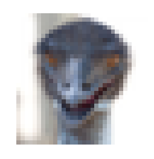
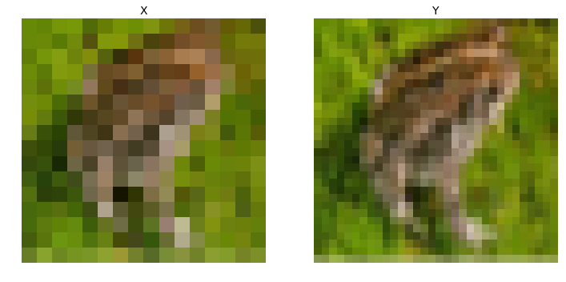
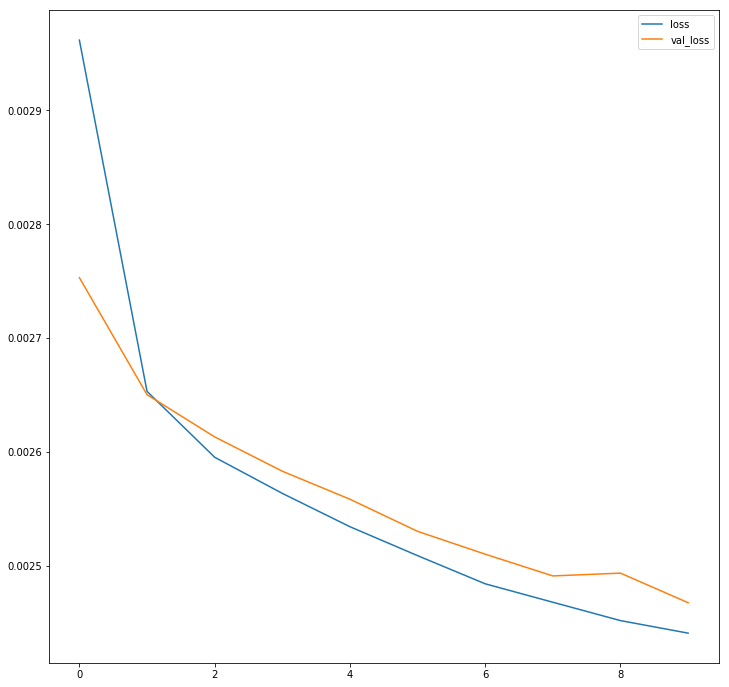
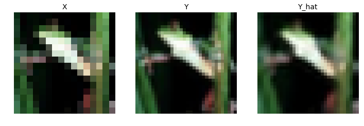

Find the paper [here](https://arxiv.org/abs/1511.04587)

## At a Glance

- The paper proposes an effective model for single image super resolution that is highly accurate.
- Increasing the model depth increases overall accuracy.
- Contextual information over large regions is built up by cascading multiple smaller filters.
- Convergence speed is maximized by learning only residuals, and using large learning rates with adjustable gradient clipping.
- May be usefull in denoising and compression artifact removal

## Introduction

The goal of the paper is to introduce a single image super resolution (SISR) model that addresses some of the limitations of a previously proposed framework, the SRCNN.

The advantages of using CNNs for super resolution is that they provide an effective end-to-end solution, whereas past work required hand-engineered features.

The paper lists three limitations of SRCNNs and how VDSR can address these:
- *SRCNN is context dependent in small images* - Information in a small patch does not hold enough information for detail recovery. VDSR addresses this by cascading small filters to capture large region information.

- *Training for deep CNNs is slow* - VDSR addresses this by only learning *residuals* - the difference between the Low Resolution (LR) and High Resolution (HR) images. This works because the LR and HR images share the same information to a very large extent. Additionally, very large learning rates are used during training, with adjustable gradient clipping.

- *SRCNN only works for a single scale* - A single VDSR model is adequate for multi-scale-factor super resolution.

## Proposed Method

### Proposed Network

The network takes in an interpolated LR (ILR) image of shape $w \times h \times 3$ and predicts the residual image ($ w \times h \times 1$) which is then added onto the ILR to yield the HR image ($w \times h \times 3$).

The network is comprised of $L$ layers where all but $l=1,20$ (first and last) follow ZEROPAD -> CONV($3\times 3, 64 \text{ filters}$) -> RELU. The first layer operates on the input and the last layer consists of ZEROPAD -> CONV($3\times 3, 1 \text{ filter}$) to output the desired residual image.

The purpose of zero-padding before each convolution is to preserve the size of the feature maps. One issue with deep CNNs is that the convolution operation reduces the size of the feature map. Pixels on the border cannot be inferred properly, so usually SISR methods crop the boundary out which is fine for shallow models, but for deep CNNs it is unfeasible. Zero-padding addresses this issue, and is reported to work well.

$L$ is specified to be $20$ in the paper's training description.

### Training

The Loss function was the mean squared error averaged over the training set: $\frac{1}{2}  || \pmb{y} - \pmb{\hat{y}}||^2$, where $\pmb{y}$ is the HR image corresponding to the input LR image, and $\pmb{\hat{y}}$ is the model predicted HR image.

#### Residual Learning

The residual image is defined as $\pmb{r}=\pmb{y}-\pmb{x}$. Most values are likely to be small or zero, which is desirable when training. Since we want the network to predict the residual $\pmb{r}$, the loss function can be rewritten as $\frac{1}{2}  || \pmb{r} - \pmb{\hat{y}}||^2$. However, in the actual network training, the loss is the $L_2$ norm betweeen the reconstructed image $\pmb{r}+\pmb{x}$ and the ground truth $\pmb{y}$.

Mini-batch Gradient Descent was used with a momentum optimizer (I assume, as the paper references momentum $\beta = 0.9$, could also be the Adam optimizer) and a weight decay of $0.0001$ (weight decay means adding a regularizing term to the loss, $\mathcal{L} = \frac{1}{2}  || \pmb{y} - \pmb{\hat{y}}||^2 + \gamma L_2, \gamma=0.0001$)

#### Adjustable Gradient Clipping

An issue when training deep CNNs is the slow speed of convergence. One tactic to speed up training is to increase the learning rate $\alpha$, however this can lead to exploding gradients.

One solution to this is referred to as Gradient Clipping where the gradients of the parameters with respect to the loss function are clipped between a certain range $[-\theta, \theta]$. The issue with this approach is that, at the start of training when the learning rate is very high, $\theta$ must be very small to prevent exploding gradients, however as the network is trained, learning rate is annealed and as such $\alpha \frac{\partial{\mathcal{L}}}{\partial{W}}$ gets increasingly smaller.

The suggested method is to set gradients between $[-\frac{\theta}{\alpha}, \frac{\theta}{\alpha}]$, so the clipping is adjusted based on the current learning rate.

#### Multi-Scale

The model can be adapted to handle mutliple scales by simply training it on data of varying scales.
Images are divided into sub-images without overlap where sub-images from different scales are present.

The paper tests the performance of a model trained with $s_{train}=\\{2\\}$ (scale factor of 2 in the training set) on different input scales and sees that for $s_{train} \ne s_{test}$, performance is bad. However when $s_{train}=\\{2,3,4\\}$ the performance at each scale factor is comparable with a corresponding single-scale network, even outperforming single-scale models at large scales (3,4).

### Results

VDSR outperforms Bicubic, A+, RFL, SelfEx, and SRCNN (all methods listed) in every regard (PSNR/SSIM/time).

Benchmarks were made on Set5, Set14, B100 and Urban100 datasets.


## Implementation

After reading the paper, I decided to implement VDSR in Keras. Please note this is a very quick-and-dirty implementation, it forgoes the adjustable gradient clipping and the learning rate adjustments made in the paper.

I also test the model on one of the classes in the CIFAR10 dataset, namely the frog class.


```python
import numpy as np
import matplotlib.pyplot as plt
import cv2

import tensorflow as tf
from tensorflow.keras.models import Model
from tensorflow.keras.layers import Conv2D, ZeroPadding2D, ReLU, Add, Input
from tensorflow.keras.optimizers import Adam
from tensorflow.keras.datasets import cifar10
from tensorflow.keras.backend import resize_images
```


```python
def vdsr(input_dim, l):
    
    #Define input layer
    LR = Input(shape=input_dim, name='input')
    
    #First convolution
    X = ZeroPadding2D()(LR)
    X = Conv2D(64,(3,3), name='CONV1')(X)
    X = ReLU()(X)
    
    #Repeat convolution layers untill last layer
    for i in range(l-2):
        X = ZeroPadding2D()(X)
        X = Conv2D(64, (3,3), name='CONV%i' % (i+2))(X)
        X = ReLU()(X)
    
    #Final layer, output is residual image
    X = ZeroPadding2D()(X)
    residual = Conv2D(1, (3,3), name='CONV%i' % l)(X)
    
    #Add residual to LR
    out = Add()([LR, residual])
    
    return Model(LR, out)
        
```


```python
#Load the cifar10 dataset
(x_train, y_train), (x_test, y_test) = cifar10.load_data()
classes = ['airplane','automobile','bird','cat','deer','dog','frog', 'horse','ship','truck']

#Example image
i = np.random.randint(x_train.shape[0])

plt.imshow(x_train[i])
plt.axis('off')
plt.title(classes[y_train[i][0]], color='w')
plt.show()
```





```python
#I'll use just the frog classes
train_idx = (y_train == [classes.index('frog')])

y_train = x_train[np.squeeze(train_idx)]

test_idx = (y_test == [classes.index('frog')])

y_test = x_test[np.squeeze(test_idx)]

print("Training set ground truth has shape: " + str(y_train.shape))

print("Test set ground truth has shape: " + str(y_test.shape))
```

    Training set ground truth has shape: (5000, 32, 32, 3)
    Test set ground truth has shape: (1000, 32, 32, 3)


```python
w , h = y_train.shape[1:-1]
scale_factor = 2

x_train = []
for img in y_train:
    img_re = cv2.resize(img, dsize=(w/scale_factor, h/scale_factor), interpolation=cv2.INTER_CUBIC)
    x_train.append(img_re)

x_train = np.asarray(x_train)

x_test = []
for img in y_test:
    img_re = cv2.resize(img, dsize=(w/scale_factor, h/scale_factor), interpolation=cv2.INTER_CUBIC)
    #Normalize
    x_test.append(img_re)

x_test = np.asarray(x_test)

print("Training set has shape: " + str(x_train.shape))

print("Test set has shape: " + str(x_test.shape))
```

    Training set has shape: (5000, 16, 16, 3)
    Test set has shape: (1000, 16, 16, 3)


```python
#Example sample and label
i = np.random.randint(x_train.shape[0])

fig, ax = plt.subplots(1,2)
fig.set_size_inches(12,6)
fig.set_facecolor('w')

ax[0].imshow(x_train[i])
ax[0].set_title('X', fontsize=14)
ax[0].axis('off')

ax[1].imshow(y_train[i])
ax[1].set_title('Y', fontsize=14)
ax[1].axis('off')

plt.axis('off')
plt.show()
```





```python
#Define the model
input_dim = y_train.shape[1:]
L = 20
model = vdsr(input_dim, L)
model.compile(optimizer=Adam(learning_rate=0.000075,beta_1=0.9), loss='mse', metrics=['accuracy'])
```


```python
#Need to upscale input
x_train_scaled = resize_images(x_train/255.0, scale_factor, scale_factor,'channels_last', interpolation='bilinear')
x_test_scaled = resize_images(x_test/255.0, scale_factor, scale_factor,'channels_last', interpolation='bilinear')


history = model.fit(x_train_scaled, y_train/255., batch_size=64, epochs=10, validation_data=(x_test_scaled, y_test/255.0))
```

    Train on 5000 samples, validate on 1000 samples
    Epoch 1/10
    5000/5000 [==============================] - 138s 28ms/sample - loss: 0.0030 - accuracy: 0.9441 - val_loss: 0.0028 - val_accuracy: 0.9451
    Epoch 2/10
    5000/5000 [==============================] - 138s 28ms/sample - loss: 0.0027 - accuracy: 0.9441 - val_loss: 0.0027 - val_accuracy: 0.9451
    Epoch 3/10
    5000/5000 [==============================] - 139s 28ms/sample - loss: 0.0026 - accuracy: 0.9441 - val_loss: 0.0026 - val_accuracy: 0.9451
    Epoch 4/10
    5000/5000 [==============================] - 133s 27ms/sample - loss: 0.0026 - accuracy: 0.9441 - val_loss: 0.0026 - val_accuracy: 0.9451
    Epoch 5/10
    5000/5000 [==============================] - 135s 27ms/sample - loss: 0.0025 - accuracy: 0.9441 - val_loss: 0.0026 - val_accuracy: 0.9451
    Epoch 6/10
    5000/5000 [==============================] - 142s 28ms/sample - loss: 0.0025 - accuracy: 0.9441 - val_loss: 0.0025 - val_accuracy: 0.9451
    Epoch 7/10
    5000/5000 [==============================] - 132s 26ms/sample - loss: 0.0025 - accuracy: 0.9441 - val_loss: 0.0025 - val_accuracy: 0.9451
    Epoch 8/10
    5000/5000 [==============================] - 140s 28ms/sample - loss: 0.0025 - accuracy: 0.9441 - val_loss: 0.0025 - val_accuracy: 0.9451
    Epoch 9/10
    5000/5000 [==============================] - 133s 27ms/sample - loss: 0.0025 - accuracy: 0.9441 - val_loss: 0.0025 - val_accuracy: 0.9451
    Epoch 10/10
    5000/5000 [==============================] - 130s 26ms/sample - loss: 0.0024 - accuracy: 0.9441 - val_loss: 0.0025 - val_accuracy: 0.9451


```python
fig, ax = plt.subplots()
fig.set_size_inches(12,12)
fig.set_facecolor('w')

ax.plot(history.history['loss'], label='loss')
ax.plot(history.history['val_loss'], label='val_loss')
plt.legend()
plt.show()
```





```python
#Example sample and label
i = np.random.randint(x_train.shape[0])

x_i = resize_images(np.expand_dims(x_train[i],axis=0), scale_factor, scale_factor,'channels_last', interpolation='bilinear')

y_hat = model.predict(x_i/255.0)[0]

fig, ax = plt.subplots(1,3)
fig.set_size_inches(12,6)
fig.set_facecolor('w')

ax[0].imshow(x_train[i])
ax[0].set_title('X', fontsize=14)
ax[0].axis('off')

ax[1].imshow(y_train[i])
ax[1].set_title('Y', fontsize=14)
ax[1].axis('off')

ax[2].imshow(y_hat)
ax[2].set_title('Y_hat', fontsize=14)
ax[2].axis('off')

plt.axis('off')
plt.show()
```





The model seems to work well and converges quickly, even for a fixed learning rate. Of note is that the CIFAR10 images are of size $32\times 32 \times 3$, so to test super resolution with a scale factor of 2, the input images are resized from $16 \times 16 \times 3$. Compared to Set5's $256 \times 256 \times 3$ images used in the paper, this test isn't reflective of VDSR's ability to infer detail.