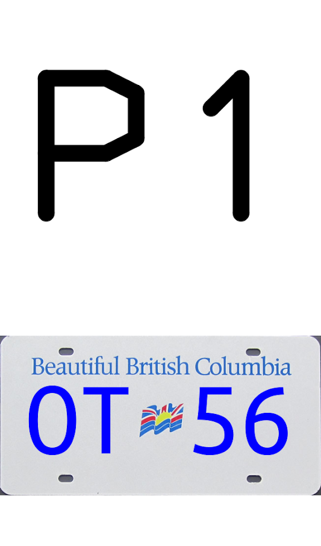
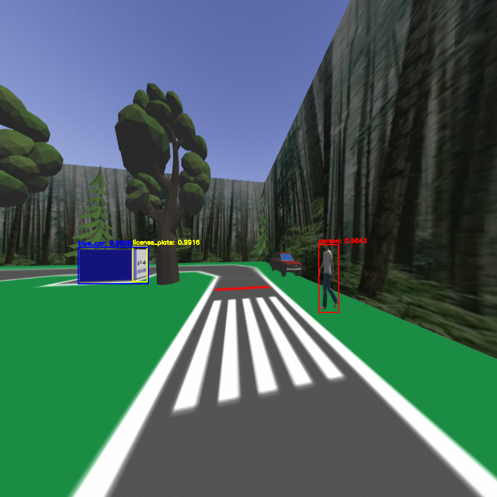
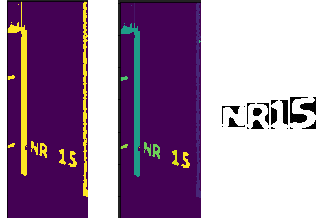
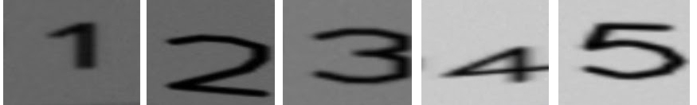

## Overview

ENPH 353 is a project course designed to teach machine learning techinques with an end-of-term competition. The premise of the competition is to develop algorithms that allow a simulated robot to traverse a parking lot and correctly identify locations and number plates of parked cars while avoiding pedestrians and a moving vehicle. The simulation took place in [Gazebo](http://gazebosim.org/) in [ROS](https://www.ros.org/)

## The Competition

The image above shows the parking lot for the competition. The robot is the white, square car. It's task is to drive on the roads while collecting the license plates on the blue rectangular cars. Additionally, it must avoid pedestrians and the truck driving around the inside track.

<figure>
    
    <figcaption>Example license plate</figcaption>
</figure>

The license plates hold two pieces of information, the position of the car marked with the larger P1 above, and a BC auto-generated license plate with two letters and two numbers.

The inputs to the system were the images captured by a camera mounted on the robot's frame and as outputs the robot would publish velociy commands to guide the robot as well as positions and license plate data to a server for scoring.

The scores are determined by the following:

|        Rules      | Points                    |
| ------------------| :------------------------------: |
| Correctly record license plate and position for a car on outside track   |  +6            |
| Correctly record license plate and position for a car on inside track    | +8             |
| More than two wheels outside of the track           | -2             |
|Collide with white pick-up truck |-5|
|Hit pedestrian|-10|
|Drive one full loop around the outer track| +5|

## The Strategy

### YOLO

I decided to use the [YOLO](https://pjreddie.com/darknet/yolo/) framework to allow the robot to understand it's environment. Yolo stands for "You Only Look Once", and is a state of the art object detection system. I used YOLOv3 to obtain labeled bounding boxes around classes of interest, namely the blue parked cars, pedestrians, the truck, and license plates. 

YOLO works by taking an image and dividing into smaller subsections, and predicting locations and accuracies for bounding boxes of a certain class. The advantage of using YOLO is that it is incredibly fast compared to other classifier models, allowing us to obtain near real-time predictions.

Training the model required around 200 labeled images taken from simulation video, trained for about 25000 iterations. In ROS, a node subscribes to the camera feed and passes the images through yolo. A YoloElement message was made to store each bounding box for each class, and publish it to a yolo node. This node informs pedestrian logic and gives bounding boxes for the license plate detection as well.

<figure>
    
    <figcaption>YOLO Output - The robot is waiting at the cross section. It detects the pedestrian as well as the car and license plate ahead.</figcaption>
</figure>

### Navigation

The main components of the robot's navigation are the driver and controller.

#### Driver

The essential method for Karen’s driving was `get_twist()`. This method used computer vision techniques to return a Twist command (Twist is a message that contains all the velocities of the robot) which would be called by the controller to drive the robot. The driver has three main approaches to following the road.

The first two approaches are very similar. The robot can follow the road by either looking at the right edge or the left edge of the road and following it. These approaches are mirror, so the following is a list of steps taken to perform right edge following:
 1. Scale input image to a smaller size and apply HSV mask to filter out the road.
 2. Find the first pixel of a road from the right-hand side at an upper and lower location.
 3. Compare these pixel locations to the expected locations to determine the current error.
 4. If the error magnitude exceeds a threshold, turn left if the error is negative, or right if the error is positive, otherwise, drive straight.

<figure>
    
    <figcaption>Driving Straight - the relative difference in white lines is within the threshold.</figcaption>
    
    <figcaption>Left Turn - the relative difference causes a negative error, robot will turn left.</figcaption>
</figure>

This method was found to be robust. Even when starting off the road, the robot will turn and navigate towards the road, and begin following the edge. However, general navigation and knowing which way to drive is not solved by this approach. The controller must solve these challenges. Note, to follow the left edge, the white lines are flipped about the y-axis in the above figures.

The third approach of road following is to use the “center of mass” of the road. This method is not as robust as the above edge following. However, this approach is necessary when the edges of the road are misleading. This approach follows a similar idea as edge following, except it differs in steps 2 and 3:

 2. Threshold the image so that the road is a binary mask.
 3. Use OpenCV to compute the moments of the image, then compare the x coordinate of the center of mass of the road with the center of the image to get the error.

In general, each of these approaches could follow the road successfully. It is up to the controller to decide when to use each approach.

#### Controller

The robot's controller makes decisions about when and where to turn, when to stop for pedestrians, and when to stop for the pick-up truck. The following is a flow chart illustrating the state diagram of the controller:

<svg xmlns="http://www.w3.org/2000/svg" xmlns:xlink="http://www.w3.org/1999/xlink" version="1.1" width="631px" viewBox="-0.5 -0.5 631 791" content="&lt;mxfile host=&quot;app.diagrams.net&quot; modified=&quot;2020-06-12T02:21:46.131Z&quot; agent=&quot;5.0 (X11; Linux x86_64) AppleWebKit/537.36 (KHTML, like Gecko) Chrome/80.0.3987.132 Safari/537.36&quot; etag=&quot;NDhWZBUGkTZ4FVD42Wzh&quot; version=&quot;13.2.3&quot; type=&quot;device&quot;&gt;&lt;diagram id=&quot;C5RBs43oDa-KdzZeNtuy&quot; name=&quot;Page-1&quot;&gt;7Vxbc5s4FP41ntl9SAckbn5srpvd9LJJumn6JoNss8HIC6Rx+utXMhIGSY5JbUTidCYzQbIQcG7fd44EA3g0W5xlaD79QCKcDIAVLQbweACA7QAwYH9W9Fj2BA7vmGRxxAetOq7iH5h3Wrz3Po5w3hhYEJIU8bzZGZI0xWHR6ENZRh6aw8YkaV51jiZY6bgKUaL23sRRMeVPAfxV/x84nkzFlW1vWP4yQ2Iwf5J8iiLyUOuCJwN4lBFSlEezxRFOmPCEXG7OH2+Sizvv7M+/8//Ql8O/rj/+c1BOdvqcU6pHyHBa7HZqrsvvKLnn8uLPWjwKAWbkPo0wm8QawMNpMUvooU0P/8VF8cgVju4LQrtIVkzJhKQouSBkzseNSVrwYTZr4zR6zxRL26OEhHdl12mcJPwatMXHB7SVFxm5q3THJqgUwQYnaISTQxTeTZY3ekQSktGfUpJiNlVEjYE/y+rmTla9hy1lK0wXZRPMx52dFdFiGi2ybx/9b8d4PP9s3XIdWOy6NfvjGjnDZIaL7JEOyHCCivh700gRt/VJNa469TOJ6f0BS/gl5BfiXgmFkYopcnKfhZifVbcKaSLgbJiofGJlInpQe55V19Lo9AaolVcLA9ysw6aJao1QY6w1U9Yqrb1VlMLebBUbrWdbY2lo57mqsBRVnCxiZirXB+dpgbOchueYpE8ECCbKh2lc4Ks5WsrjgWJKU9Jj6ubCRwcARggH47Dy8tovXhjg0bjSzXecFXjxE9pRpSlmCZqWD4a8/bCCCVug2LQGEZ7VkQKcN+EL3QREB7hNbdpm45jt9KErTB30Kzv9nctbt7VfjhcCUFnjkTeM6LdNrHONGAIcGjYExYkvl6EDWEzz9N8pSRLKXoD1GWcxvRrO9iWiQv+lRVRvHwOoa4hM6P0LuhJhbBloKeVHj7VhczYgf+I6EsO1fSm92TBe3NfKfMo72Kmz+4qzfyRak7tgWUrTTFAST1J6HGJGrmgHc8iYJq7v+Q+zOIpKi8R5/AONlvMxm+Sio5O7hwP3+CmP5lk1P3lQ5bJ1Y1zvOWs9/cB6B30BecLby9aW5hU05jxwvOYEZDzOcSdxe9gnfts19F5heT/43Tq8WHoT2dIA3DV+bwq/XcWlrzBeonWEKaTGiLrmqYrYUzIb3efPRuvxeAxCLVpH3shzvS7R2pMEDTVoDTVoHXSF1jbsxQdTeu9f643SC4Er2is/XLaMEWlTVYM1jhj8XGXouUCvXMdyuwduWy123KBlseNLWsTL848ykufUsHZJzrEdudjXufvQ8yHq0t1dILm7o3F3YJKc27Yi27eaMrf29G0xdzuFqcXaW5wrSqSGW3RHdZlGc76a0KG7OFJUsl3VXRyNt8hBcnfCD14LQV0HqH7vgGo0c94WB0Uha13Cq+AmNICb4FfMNlu+dE3XsdX8h7KUBIcFo0IemjGCk47y+VLE1gXK2c3TXxIW80cZPZqwo2VxM14WN62LmAb+HOvHUWnhfcmo5NJYoKFYrgY05BL17kBjqGhTU6DaC8CuHEWETytQhK/LZjsDbFEQewtsqVpkEcLXWL5RtgR6WY7rGnMAbElggBlw8iyz4OT0wz4En+X0o2K0G+hshPJpVSd4Mabh9JpCitusBcULPNasjso84beTtCQT52m6/H+dofDud5U2vNKlU28N7eutOiM2SL7efLPvdBO0TTdLpzCeb0oFQQ8+vcAqj3cdAwusoNdluZeUb7a2JtjNupyC/Yb31QA1MT1PV3gg48VlnE72Ja0MJGzQbKsJNNDQ2TqdWKR/A1ml44Om1YsaeF9ZJexljbTr4CZEuDm4gT7ZK+wXjRqcCPS7S6S1xrbON9Zs95LYiC/wwRAcieevxcBqY+clQRH9d/RBRZ/9yE78ttkJ7CwMqtts97i41txo5/VdXIN7WVyDoC0GmSmuBYYJNuxls/Q+JfztLWgnmLhtwh/YGxaY10Bspwm/kOGv9cftd3T6vgamddlKZ+uPUE3aT+M0XtbFZYHnUzRnh1O8QDSGMMStXpCpeqt3ZsDzFROEWK+YUeA6rtWlYqStGoEmgx8apU+tXlzYC/bkBMOmUwxtRfZmM3i1erLH1FUyfK9n6uq4fZCcxkrgi91v7rRO6Z0t6ct2KlQz7+vsPrxjGXdC8n0BcyC9B6Or+uowo7Oqr9i41Nfi+zO9xejqu+O0dJ1+lvps6SMfrgkm7/ayWcOMpndfzpQrbDL129HLNrIl+BsWfdfdV6eWI7zpiZdzztjnfZQo/zrfzJE4ksfff2pkbZYm0rudkSTv7TBUYDkbpW+WoapbdtU4uvqCVpigPI/DNitGHb210fYTWy+YuNZ0rdueLfq2jPFA3nDjSDbU+ptd0lZnT+Z8OwIL5TobwEIZ70ADNEMtGIoqXz5HqajznadxEdP49IOVAW8/XXxSS4FyeRGl0aBePCxLhcC6xChabTmhN12/juKrXZe1KGwFkaMDrgCMoNclcEnqBrrXHXSrgj+RotDm6kOLpemsPlcJT/4H&lt;/diagram&gt;&lt;/mxfile&gt;" onclick="(function(svg){var src=window.event.target||window.event.srcElement;while (src!=null&amp;&amp;src.nodeName.toLowerCase()!='a'){src=src.parentNode;}if(src==null){if(svg.wnd!=null&amp;&amp;!svg.wnd.closed){svg.wnd.focus();}else{var r=function(evt){if(evt.data=='ready'&amp;&amp;evt.source==svg.wnd){svg.wnd.postMessage(decodeURIComponent(svg.getAttribute('content')),'*');window.removeEventListener('message',r);}};window.addEventListener('message',r);svg.wnd=window.open('https://app.diagrams.net/?client=1&amp;lightbox=1&amp;edit=_blank');}}})(this);" style="cursor:pointer;max-width:100%;max-height:791px;"><defs/><g><path d="M 120 190 L 159.88 190" fill="none" stroke="#000000" stroke-miterlimit="10" pointer-events="stroke"/><path d="M 168.88 190 L 159.88 194.5 L 159.88 185.5 Z" fill="none" stroke="#000000" stroke-miterlimit="10" pointer-events="all"/><path d="M 280 190 L 353.63 190" fill="none" stroke="#000000" stroke-miterlimit="10" pointer-events="stroke"/><path d="M 358.88 190 L 351.88 193.5 L 353.63 190 L 351.88 186.5 Z" fill="#000000" stroke="#000000" stroke-miterlimit="10" pointer-events="all"/><rect x="170" y="160" width="110" height="60" rx="9" ry="9" fill="#dae8fc" stroke="#6c8ebf" pointer-events="all"/><g transform="translate(-0.5 -0.5)"><switch><foreignObject style="overflow: visible; text-align: left;" pointer-events="none" width="100%" height="100%" requiredFeatures="http://www.w3.org/TR/SVG11/feature#Extensibility">

Exit T-Intersection

</foreignObject><text x="225" y="194" fill="#000000" font-family="Helvetica" font-size="12px" text-anchor="middle">Exit T-Intersection</text></switch></g><path d="M 415 160 L 415 86.37" fill="none" stroke="#000000" stroke-miterlimit="10" pointer-events="stroke"/><path d="M 415 81.12 L 418.5 88.12 L 415 86.37 L 411.5 88.12 Z" fill="#000000" stroke="#000000" stroke-miterlimit="10" pointer-events="all"/><path d="M 415 220 L 415 240 L 415 230 L 415 243.63" fill="none" stroke="#000000" stroke-miterlimit="10" pointer-events="stroke"/><path d="M 415 248.88 L 411.5 241.88 L 415 243.63 L 418.5 241.88 Z" fill="#000000" stroke="#000000" stroke-miterlimit="10" pointer-events="all"/><rect x="360" y="160" width="110" height="60" rx="9" ry="9" fill="#dae8fc" stroke="#6c8ebf" pointer-events="all"/><g transform="translate(-0.5 -0.5)"><switch><foreignObject style="overflow: visible; text-align: left;" pointer-events="none" width="100%" height="100%" requiredFeatures="http://www.w3.org/TR/SVG11/feature#Extensibility">

Right Edge Follow Perimeter

</foreignObject><text x="415" y="194" fill="#000000" font-family="Helvetica" font-size="12px" text-anchor="middle">Right Edge Follow...</text></switch></g><path d="M 350 40 L 320 40 L 320 180 L 353.63 180" fill="none" stroke="#000000" stroke-miterlimit="10" pointer-events="stroke"/><path d="M 358.88 180 L 351.88 183.5 L 353.63 180 L 351.88 176.5 Z" fill="#000000" stroke="#000000" stroke-miterlimit="10" pointer-events="all"/><g transform="translate(-0.5 -0.5)"><switch><foreignObject style="overflow: visible; text-align: left;" pointer-events="none" width="100%" height="100%" requiredFeatures="http://www.w3.org/TR/SVG11/feature#Extensibility">

No

</foreignObject><text x="331" y="34" fill="#000000" font-family="Helvetica" font-size="11px" text-anchor="middle">No</text></switch></g><path d="M 480 40 L 500 40 L 490 40 L 503.63 40" fill="none" stroke="#000000" stroke-miterlimit="10" pointer-events="stroke"/><path d="M 508.88 40 L 501.88 43.5 L 503.63 40 L 501.88 36.5 Z" fill="#000000" stroke="#000000" stroke-miterlimit="10" pointer-events="all"/><path d="M 415 0 L 480 40 L 415 80 L 350 40 Z" fill="#fff2cc" stroke="#d6b656" stroke-miterlimit="10" pointer-events="all"/><g transform="translate(-0.5 -0.5)"><switch><foreignObject style="overflow: visible; text-align: left;" pointer-events="none" width="100%" height="100%" requiredFeatures="http://www.w3.org/TR/SVG11/feature#Extensibility">

See Pedestrian?

</foreignObject><text x="415" y="44" fill="#000000" font-family="Helvetica" font-size="12px" text-anchor="middle">See Pedestrian?</text></switch></g><path d="M 570 70 L 570 175 L 476.37 175" fill="none" stroke="#000000" stroke-miterlimit="10" pointer-events="stroke"/><path d="M 471.12 175 L 478.12 171.5 L 476.37 175 L 478.12 178.5 Z" fill="#000000" stroke="#000000" stroke-miterlimit="10" pointer-events="all"/><rect x="510" y="10" width="120" height="60" rx="9" ry="9" fill="#e1d5e7" stroke="#9673a6" pointer-events="all"/><g transform="translate(-0.5 -0.5)"><switch><foreignObject style="overflow: visible; text-align: left;" pointer-events="none" width="100%" height="100%" requiredFeatures="http://www.w3.org/TR/SVG11/feature#Extensibility">

Wait Untill Crossed

</foreignObject><text x="570" y="44" fill="#000000" font-family="Helvetica" font-size="12px" text-anchor="middle">Wait Untill Crossed</text></switch></g><path d="M 570 70 L 570 70" fill="none" stroke="#000000" stroke-miterlimit="10" pointer-events="stroke"/><path d="M 570 70 L 570 70 L 570 70 L 570 70 Z" fill="#000000" stroke="#000000" stroke-miterlimit="10" pointer-events="all"/><rect x="470" y="20" width="40" height="20" fill="none" stroke="none" pointer-events="all"/><g transform="translate(-0.5 -0.5)"><switch><foreignObject style="overflow: visible; text-align: left;" pointer-events="none" width="100%" height="100%" requiredFeatures="http://www.w3.org/TR/SVG11/feature#Extensibility">

Yes

</foreignObject><text x="490" y="34" fill="#000000" font-family="Helvetica" font-size="12px" text-anchor="middle">Yes</text></switch></g><path d="M 490 295 L 570 295 L 570 205 L 476.37 205" fill="none" stroke="#000000" stroke-miterlimit="10" pointer-events="stroke"/><path d="M 471.12 205 L 478.12 201.5 L 476.37 205 L 478.12 208.5 Z" fill="#000000" stroke="#000000" stroke-miterlimit="10" pointer-events="all"/><path d="M 415 340 L 415 373.63" fill="none" stroke="#000000" stroke-miterlimit="10" pointer-events="stroke"/><path d="M 415 378.88 L 411.5 371.88 L 415 373.63 L 418.5 371.88 Z" fill="#000000" stroke="#000000" stroke-miterlimit="10" pointer-events="all"/><path d="M 415 250 L 490 295 L 415 340 L 340 295 Z" fill="#fff2cc" stroke="#d6b656" stroke-miterlimit="10" pointer-events="all"/><g transform="translate(-0.5 -0.5)"><switch><foreignObject style="overflow: visible; text-align: left;" pointer-events="none" width="100%" height="100%" requiredFeatures="http://www.w3.org/TR/SVG11/feature#Extensibility">

Collected  Last  Perimiter License  Plate?

</foreignObject><text x="415" y="299" fill="#000000" font-family="Helvetica" font-size="12px" text-anchor="middle">Collected  Last...</text></switch></g><rect x="500" y="278" width="30" height="20" fill="none" stroke="none" pointer-events="all"/><g transform="translate(-0.5 -0.5)"><switch><foreignObject style="overflow: visible; text-align: left;" pointer-events="none" width="100%" height="100%" requiredFeatures="http://www.w3.org/TR/SVG11/feature#Extensibility">

No

</foreignObject><text x="515" y="292" fill="#000000" font-family="Helvetica" font-size="12px" text-anchor="middle">No</text></switch></g><rect x="380" y="350" width="40" height="20" fill="none" stroke="none" pointer-events="all"/><g transform="translate(-0.5 -0.5)"><switch><foreignObject style="overflow: visible; text-align: left;" pointer-events="none" width="100%" height="100%" requiredFeatures="http://www.w3.org/TR/SVG11/feature#Extensibility">

Yes

</foreignObject><text x="400" y="364" fill="#000000" font-family="Helvetica" font-size="12px" text-anchor="middle">Yes</text></switch></g><path d="M 415 440 L 415 460 L 415 440 L 415 453.63" fill="none" stroke="#000000" stroke-miterlimit="10" pointer-events="stroke"/><path d="M 415 458.88 L 411.5 451.88 L 415 453.63 L 418.5 451.88 Z" fill="#000000" stroke="#000000" stroke-miterlimit="10" pointer-events="all"/><path d="M 355 410 L 265 410 L 265 453.63" fill="none" stroke="#000000" stroke-miterlimit="10" stroke-dasharray="3 3" pointer-events="stroke"/><path d="M 265 458.88 L 261.5 451.88 L 265 453.63 L 268.5 451.88 Z" fill="#000000" stroke="#000000" stroke-miterlimit="10" pointer-events="all"/><rect x="355" y="380" width="120" height="60" rx="9" ry="9" fill="#dae8fc" stroke="#6c8ebf" pointer-events="all"/><g transform="translate(-0.5 -0.5)"><switch><foreignObject style="overflow: visible; text-align: left;" pointer-events="none" width="100%" height="100%" requiredFeatures="http://www.w3.org/TR/SVG11/feature#Extensibility">

Left Edge Follow (Enter Inner Track)

</foreignObject><text x="415" y="414" fill="#000000" font-family="Helvetica" font-size="12px" text-anchor="middle">Left Edge Follow...</text></switch></g><path d="M 455 500 L 510 500 L 510 410 L 481.37 410" fill="none" stroke="#000000" stroke-miterlimit="10" pointer-events="stroke"/><path d="M 476.12 410 L 483.12 406.5 L 481.37 410 L 483.12 413.5 Z" fill="#000000" stroke="#000000" stroke-miterlimit="10" pointer-events="all"/><path d="M 415 540 L 415 573.63" fill="none" stroke="#000000" stroke-miterlimit="10" pointer-events="stroke"/><path d="M 415 578.88 L 411.5 571.88 L 415 573.63 L 418.5 571.88 Z" fill="#000000" stroke="#000000" stroke-miterlimit="10" pointer-events="all"/><path d="M 415 460 L 455 500 L 415 540 L 375 500 Z" fill="#fff2cc" stroke="#d6b656" stroke-miterlimit="10" pointer-events="all"/><g transform="translate(-0.5 -0.5)"><switch><foreignObject style="overflow: visible; text-align: left;" pointer-events="none" width="100%" height="100%" requiredFeatures="http://www.w3.org/TR/SVG11/feature#Extensibility">

In Inner Ring?

</foreignObject><text x="415" y="504" fill="#000000" font-family="Helvetica" font-size="12px" text-anchor="middle">In Inner...</text></switch></g><rect x="462" y="482" width="30" height="20" fill="none" stroke="none" pointer-events="all"/><g transform="translate(-0.5 -0.5)"><switch><foreignObject style="overflow: visible; text-align: left;" pointer-events="none" width="100%" height="100%" requiredFeatures="http://www.w3.org/TR/SVG11/feature#Extensibility">

No

</foreignObject><text x="477" y="496" fill="#000000" font-family="Helvetica" font-size="12px" text-anchor="middle">No</text></switch></g><path d="M 415 610 L 415 630 L 415 620 L 415 633.63" fill="none" stroke="#000000" stroke-miterlimit="10" pointer-events="stroke"/><path d="M 415 638.88 L 411.5 631.88 L 415 633.63 L 418.5 631.88 Z" fill="#000000" stroke="#000000" stroke-miterlimit="10" pointer-events="all"/><path d="M 355 587.5 L 265 587.5 L 265 546.37" fill="none" stroke="#000000" stroke-miterlimit="10" pointer-events="stroke"/><path d="M 265 541.12 L 268.5 548.12 L 265 546.37 L 261.5 548.12 Z" fill="#000000" stroke="#000000" stroke-miterlimit="10" pointer-events="all"/><rect x="355" y="580" width="120" height="30" rx="4.5" ry="4.5" fill="#dae8fc" stroke="#6c8ebf" pointer-events="all"/><g transform="translate(-0.5 -0.5)"><switch><foreignObject style="overflow: visible; text-align: left;" pointer-events="none" width="100%" height="100%" requiredFeatures="http://www.w3.org/TR/SVG11/feature#Extensibility">

Follow Road CM

</foreignObject><text x="415" y="599" fill="#000000" font-family="Helvetica" font-size="12px" text-anchor="middle">Follow Road CM</text></switch></g><rect x="384" y="550" width="40" height="20" fill="none" stroke="none" pointer-events="all"/><g transform="translate(-0.5 -0.5)"><switch><foreignObject style="overflow: visible; text-align: left;" pointer-events="none" width="100%" height="100%" requiredFeatures="http://www.w3.org/TR/SVG11/feature#Extensibility">

Yes

</foreignObject><text x="404" y="564" fill="#000000" font-family="Helvetica" font-size="12px" text-anchor="middle">Yes</text></switch></g><path d="M 415 730 L 415 750 L 415 740 L 415 753.63" fill="none" stroke="#000000" stroke-miterlimit="10" pointer-events="stroke"/><path d="M 415 758.88 L 411.5 751.88 L 415 753.63 L 418.5 751.88 Z" fill="#000000" stroke="#000000" stroke-miterlimit="10" pointer-events="all"/><path d="M 480 685 L 510 685 L 510 595 L 481.37 595" fill="none" stroke="#000000" stroke-miterlimit="10" pointer-events="stroke"/><path d="M 476.12 595 L 483.12 591.5 L 481.37 595 L 483.12 598.5 Z" fill="#000000" stroke="#000000" stroke-miterlimit="10" pointer-events="all"/><path d="M 415 640 L 480 685 L 415 730 L 350 685 Z" fill="#fff2cc" stroke="#d6b656" stroke-miterlimit="10" pointer-events="all"/><g transform="translate(-0.5 -0.5)"><switch><foreignObject style="overflow: visible; text-align: left;" pointer-events="none" width="100%" height="100%" requiredFeatures="http://www.w3.org/TR/SVG11/feature#Extensibility">

Collected  Last  Perimiter License  Plate?

</foreignObject><text x="415" y="689" fill="#000000" font-family="Helvetica" font-size="12px" text-anchor="middle">Collected  Last...</text></switch></g><path d="M 392.5 760 L 437.5 760 L 460 775 L 437.5 790 L 392.5 790 L 370 775 Z" fill="#f8cecc" stroke="#b85450" stroke-miterlimit="10" pointer-events="all"/><g transform="translate(-0.5 -0.5)"><switch><foreignObject style="overflow: visible; text-align: left;" pointer-events="none" width="100%" height="100%" requiredFeatures="http://www.w3.org/TR/SVG11/feature#Extensibility">

Finished

</foreignObject><text x="415" y="779" fill="#000000" font-family="Helvetica" font-size="12px" text-anchor="middle">Finished</text></switch></g><rect x="479" y="661" width="30" height="20" fill="none" stroke="none" pointer-events="all"/><g transform="translate(-0.5 -0.5)"><switch><foreignObject style="overflow: visible; text-align: left;" pointer-events="none" width="100%" height="100%" requiredFeatures="http://www.w3.org/TR/SVG11/feature#Extensibility">

No

</foreignObject><text x="494" y="675" fill="#000000" font-family="Helvetica" font-size="12px" text-anchor="middle">No</text></switch></g><rect x="380" y="730" width="40" height="20" fill="none" stroke="none" pointer-events="all"/><g transform="translate(-0.5 -0.5)"><switch><foreignObject style="overflow: visible; text-align: left;" pointer-events="none" width="100%" height="100%" requiredFeatures="http://www.w3.org/TR/SVG11/feature#Extensibility">

Yes

</foreignObject><text x="400" y="744" fill="#000000" font-family="Helvetica" font-size="12px" text-anchor="middle">Yes</text></switch></g><path d="M 220 500 L 200 500 L 200 487.5 L 186.37 487.5" fill="none" stroke="#000000" stroke-miterlimit="10" stroke-dasharray="3 3" pointer-events="stroke"/><path d="M 181.12 487.5 L 188.12 484 L 186.37 487.5 L 188.12 491 Z" fill="#000000" stroke="#000000" stroke-miterlimit="10" pointer-events="all"/><path d="M 265 460 L 310 500 L 265 540 L 220 500 Z" fill="#fff2cc" stroke="#d6b656" stroke-miterlimit="10" pointer-events="all"/><g transform="translate(-0.5 -0.5)"><switch><foreignObject style="overflow: visible; text-align: left;" pointer-events="none" width="100%" height="100%" requiredFeatures="http://www.w3.org/TR/SVG11/feature#Extensibility">

Truck Close?

</foreignObject><text x="265" y="504" fill="#000000" font-family="Helvetica" font-size="12px" text-anchor="middle">Truck Close?</text></switch></g><path d="M 130 475 L 130 395 L 348.63 395" fill="none" stroke="#000000" stroke-miterlimit="10" stroke-dasharray="3 3" pointer-events="stroke"/><path d="M 353.88 395 L 346.88 398.5 L 348.63 395 L 346.88 391.5 Z" fill="#000000" stroke="#000000" stroke-miterlimit="10" pointer-events="all"/><path d="M 130 525 L 130 600 L 348.63 600" fill="none" stroke="#000000" stroke-miterlimit="10" pointer-events="stroke"/><path d="M 353.88 600 L 346.88 603.5 L 348.63 600 L 346.88 596.5 Z" fill="#000000" stroke="#000000" stroke-miterlimit="10" pointer-events="all"/><rect x="80" y="475" width="100" height="50" rx="7.5" ry="7.5" fill="#e1d5e7" stroke="#9673a6" pointer-events="all"/><g transform="translate(-0.5 -0.5)"><switch><foreignObject style="overflow: visible; text-align: left;" pointer-events="none" width="100%" height="100%" requiredFeatures="http://www.w3.org/TR/SVG11/feature#Extensibility">

Wait Untill Gone

</foreignObject><text x="130" y="504" fill="#000000" font-family="Helvetica" font-size="12px" text-anchor="middle">Wait Untill Gone</text></switch></g><rect x="194" y="475" width="40" height="20" fill="none" stroke="none" pointer-events="all"/><g transform="translate(-0.5 -0.5)"><switch><foreignObject style="overflow: visible; text-align: left;" pointer-events="none" width="100%" height="100%" requiredFeatures="http://www.w3.org/TR/SVG11/feature#Extensibility">

Yes

</foreignObject><text x="214" y="489" fill="#000000" font-family="Helvetica" font-size="12px" text-anchor="middle">Yes</text></switch></g><path d="M 220 500 L 210 500 Q 200 500 200 506.25 L 200 509.38 Q 200 512.5 193.18 512.5 L 186.37 512.5" fill="none" stroke="#000000" stroke-miterlimit="10" pointer-events="stroke"/><path d="M 181.12 512.5 L 188.12 509 L 186.37 512.5 L 188.12 516 Z" fill="#000000" stroke="#000000" stroke-miterlimit="10" pointer-events="all"/><path d="M 30 150 L 90 150 L 120 190 L 90 230 L 30 230 L 0 190 Z" fill="#d5e8d4" stroke="#82b366" stroke-miterlimit="10" pointer-events="all"/><g transform="translate(-0.5 -0.5)"><switch><foreignObject style="overflow: visible; text-align: left;" pointer-events="none" width="100%" height="100%" requiredFeatures="http://www.w3.org/TR/SVG11/feature#Extensibility">

Initialize YOLO  and License Plate Reader

</foreignObject><text x="60" y="194" fill="#000000" font-family="Helvetica" font-size="12px" text-anchor="middle">Initialize YOLO...</text></switch></g></g><switch><g requiredFeatures="http://www.w3.org/TR/SVG11/feature#Extensibility"/><a transform="translate(0,-5)" xlink:href="https://desk.draw.io/support/solutions/articles/16000042487" target="_blank"><text text-anchor="middle" font-size="10px" x="50%" y="100%">Viewer does not support full SVG 1.1</text></a></switch></svg>

### Position and License Plate Recognition

#### License Plates

The algorithm takes cropped license plate images based on bounding box predictions from YOLO and does some preprocessing before passing them into a CNN for character recognition.

The preprocessing algorithm takes bounding boxes from _/yolo_ with the license plate class and crops the raw camera image to size. We obtain potential characters using and adaptive threshold followed by cv2's `findContours()` function. After some filtering based on size and aspect ratio, we end up with four predictions. The ordering of characters is determined based on the x position of the bounding box prediction.

<figure>
    
    <figcaption>License Plate Recognition - After adaptive thresholding, findContours yields potential character candidates that are filtered producing the final 4 characters seen.</figcaption>
</figure>

#### Position

To read the positions of each license plate, a region of interest is defined based on the bounding box around the license plate from YOLO. To perform character recognition, the CNN is used again, trained on data collected from allowing the robot to do several laps around the perimeter.

<figure>
    
    <figcaption>Examples of positions after cropping to ROI</figcaption>
</figure>

## Results

A total of 20 teams competed in this competition. This model was one of four to receive a perfect score of 57 points.